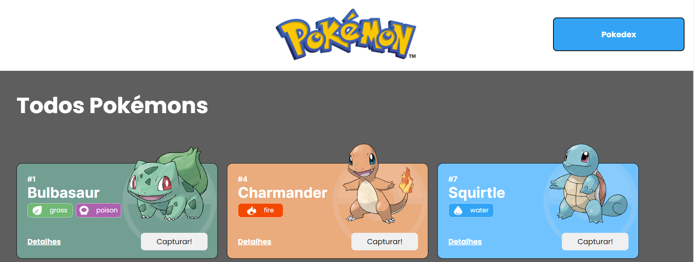
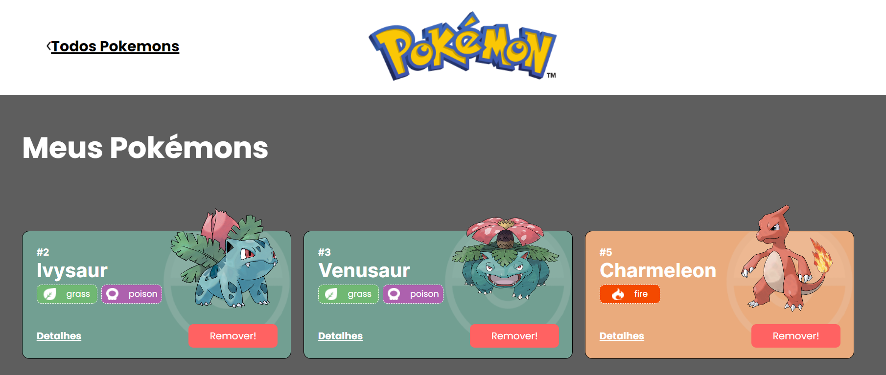

# **Projeto React Pokedex**

O Projeto React Pokedex é um site de pokémons que possui três páginas: Home, Pokedex e Detalhes. O projeto está subdivido em temas de acordo com os conteúdos que estudado durante o Módulo 2 - Frontend.

Este projeto terá como fonte de dados para a sua criação a [Poke Api](https://pokeapi.co/ "Poke Api"), uma Api pública, muito usada para aplicações focadas em aprendizado de programação e também usada em cases de processos seletivos.

## Índice
- <a href="#-funcionalidades">Funcionalidades do Projeto</a>
- <a href="#-layout">Layout</a>
- <a href="#-demonstracao">Demonstração</a>
- <a href="#-rodar">Como rodar esse projeto?</a>
- <a href="#-tecnologias-utilizadas">Tecnologias Utilizadas</a>
- <a href="#-autor">Autor</a>
- <a href="#-proximos-passos">Próximos passos</a>

## 📱 Funcionalidades do Projeto
- [x] Adicionar na Pokédex
- [x] Remover da Pokédex
- [x] Ver detalhes dos Pokémons

## 🖥️ Layout




## Demonstração
[Link de Demonstração](https://projeto-react-apis-pi.vercel.app/)


## Como rodar esse projeto?

```bash
# Clone este repositório
$ git clone linkrepo

# Acesse a pasta do projeto no seu terminal
$ git cd pokedex-api-ton

# Instale as dependências 
$ npm install

# Execute a aplicação
$ npm run start

# A aplicação será iniciada na porta 3000,
acesse pelo navegador: http://localhost:3000
```

## ⚒️ Tecnologias Utilizadas
1. [React](https://pt-br.reactjs.org/)
2. [React Router](https://reactrouter.com/en/main)
3. [Design Systems - Chakra UI](https://chakra-ui.com/)
4. [React Hooks](https://reactjs.org/docs/hooks-intro.html)
5. [Integração de APIs](https://maplink.global/blog/o-que-e-api/)
6. [Styled-components](https://styled-components.com/)


## Autor


[Linkedin](https://www.linkedin.com/in/ton-mello/)

## Próximos passos
- [] Deixar o projeto responsivo
- [] Adicionar mais Pokémons


